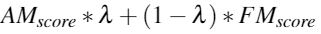
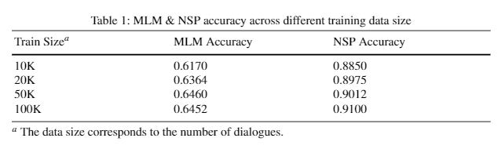
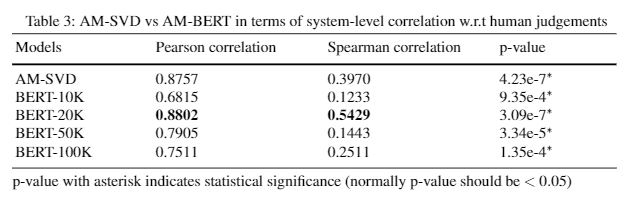
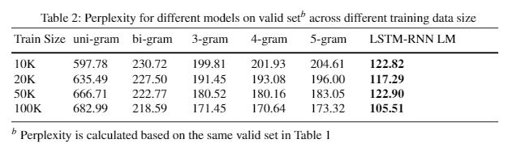
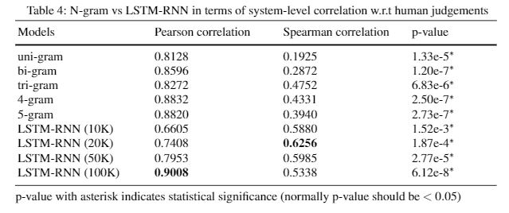

## DSTC6 End-to-End Conversational Modeling Evaluation Task

### Dataset

1. Follow instructions at https://github.com/dialogtekgeek/DSTC6-End-to-End-Conversation-Modeling.git to collect the twitter dialogues.
2. Collect the evaluation dataset at https://www.dropbox.com/s/oh1trbos0tjzn7t/dstc6_t2_evaluation.tgz
2. Extract the training, validation and test dialogues into the data folder.

### Run Adequacy Evaluation

#### Using BERT Embedding Model (most of the steps follow the google official bert repo)

##### 1. Download the [BERT-Base, Multilingual Cased] pretrained model from https://github.com/google-research/bert and configure the BERT_BASE_DIR environment variable.

##### 2. Create preprocessed training and validation data with specific training size: 
```bash
python ../../engines/embedding_models/bert/create_raw_data.py \
  --train_file /your/path/to/train.txt \
  --train_output /your/path/to/processed/train/file \
  --valid_file /your/path/to/valid.txt \
  --valid_output /your/path/to/processed/valid/file \
  --data_size {size of your data, such as 10000}
```

##### 3. Create tfrecord pretraining data
```bash
python engines/embedding_models/bert/create_pretraining_data.py \
  --input_file=data/twitter/train_clean_100k.txt \
  --output_file=data/twitter/train_clean_100k_60.tfrecord \
  --vocab_file=$BERT_BASE_DIR/vocab.txt \
  --do_lower_case=True \
  --max_seq_length=60 \
  --max_predictions_per_seq=9 \
  --masked_lm_prob=0.15 \
  --random_seed=12345 \
  --dupe_factor=5
```

##### 4. Conduct pretraining
```bash
CUDA_VISIBLE_DEVICES=1 python engines/embedding_models/bert/run_pretraining.py \
  --train_input_file=data/twitter/train_clean_100k_60.tfrecord \
  --valid_input_file=data/twitter/valid_clean_60.tfrecord \
  --output_dir=engines/embedding_models/bert/models/50k_60_2 \
  --do_train=True \
  --do_eval=True \
  --bert_config_file=$BERT_BASE_DIR/bert_config.json \
  --init_checkpoint=$BERT_BASE_DIR/bert_model.ckpt \
  --train_batch_size=8 \
  --max_seq_length=60 \
  --max_predictions_per_seq=9 \
  --num_train_steps=5000 \
  --max_eval_steps=100 \
  --num_warmup_steps=100 \
  --learning_rate=2e-5
```

##### 5. Feature extraction
```bash
CUDA_VISIBLE_DEVICES=1 python engines/embedding_models/bert/extract_features.py \
  --input_file=data/twitter/dstc6_t2_evaluation/hypotheses/hyp_clean.txt \
  --output_file=engines/embedding_models/bert/features/hyp_clean_60_100k.jsonl \
  --vocab_file=$BERT_BASE_DIR/vocab.txt \
  --bert_config_file=$BERT_BASE_DIR/bert_config.json \
  --init_checkpoint=engines/embedding_models/bert/models/100k_60/model.ckpt-10000 \
  --layers=-1,-2,-3,-4 \
  --max_seq_length=60 \
  --batch_size=8
```
```bash
CUDA_VISIBLE_DEVICES=1 python engines/embedding_models/bert/extract_features.py \
  --input_file=data/twitter/dstc6_t2_evaluation/references/ref_clean.txt \
  --output_file=engines/embedding_models/bert/features/ref_clean_60_100k.jsonl \
  --vocab_file=$BERT_BASE_DIR/vocab.txt \
  --bert_config_file=$BERT_BASE_DIR/bert_config.json \
  --init_checkpoint=engines/embedding_models/bert/models/100k_60/model.ckpt-10000 \
  --layers=-1,-2,-3,-4 \
  --max_seq_length=60 \
  --batch_size=8
```

##### 6. Compute AM Score
```bash
python engines/embedding_models/bert/calc_am.py \
  --hyp_file=engines/embedding_models/bert/features/hyp_clean_60_100k.jsonl \
  --ref_file=engines/embedding_models/bert/features/ref_clean_60_100k.jsonl \
  --strategy=top-layer-embedding-average
```

### Run Fluency Evaluation

#### Using LSTM-RNN Language Model

##### 1. Follow https://github.com/google/sentencepiece.git to train a sentencepiece tokenizer with the full training set
```bash
spm_train --input=data/twitter/train_clean_full.txt --model_prefix=data/twitter/bpe_full --vocab_size=32000 --character_coverage=0.995 --model_type=bpe
```

##### 1. Create preprocessed training and validation data (same as step 1 in Using BERT Embedding Model)

##### 2. Training the language model
```bash
SIZE=100k  
CUDA_VISIBLE_DEVICES=3 python engines/language_model/main.py \
  --data_path=data \
  --dataset=twitter \
  --data_size=${SIZE} \
  --model_name=lstm-${SIZE}-sp-nopad \
  --embedding_name=embedding.npy \
  --tokenizer_path=data/twitter/bpe_full.model \
  --hyp_out=ppl_hypothesis.txt \
  --ref_out=ppl_reference.txt \
  --batch_size=32 \
  --embedding_size=300 \
  --num_nodes=150,105,70 \
  --num_epochs=100 \
  --use_sp=True \
  --do_train=True \
  --do_eval=True \
  --do_dstc_eval=True
```
##### 3. Calculate FM Score
```bash
python engines/language_mode/calc_fm.py \
--hyp_file=data/twitter/ppl_hypothesis.txt \
--ref_file=data/twitter/ppl_reference.txt
```

### Combining AM & FM

Currently, we are using weighted average to combine the system-level scores. The equation of combining them is as follow:

<p align="center">
  
</p>

## Experimental Results

### AM BERT Model
<p align="center">
  
</p>
<p align="center">
  
</p>

### FM LSTM-RNN Language Model
<p align="center">
  
</p>
<p align="center">
  
</p>


